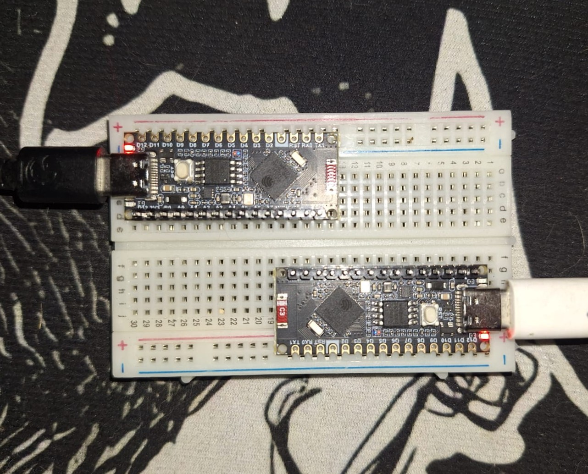

# Sistema IoT de Comunicación Cifrada con ESP32

Este proyecto implementa un sistema de comunicación entre dos nodos IoT utilizando ESP32 con WiFi, donde un nodo actúa como emisor de mensajes cifrados y otro como receptor que los descifra y valida.

---

## Modalidad del Proyecto

### Modalidad A — Simulación IoT

La implementación se realiza con microcontroladores ESP32 para simular un entorno IoT real:

- Un nodo actúa como **transmisor**
- Otro nodo actúa como **receptor**
- Comunicación mediante WiFi (TCP/IP)
- Mensajes cifrados en el emisor
- Descifrado en el receptor

---

## Arquitectura del Sistema

EMISOR ESP32  ─── WiFi TCP ───>  RECEPTOR ESP32  
Cifrado                          Descifrado  
Generación de claves            Validación de mensajes  

  

---

## Características

- Generación dinámica de claves por mensaje
- Tabla de claves (circular de 10 posiciones)
- Cifrado con múltiples operaciones:
  - XOR con clave dinámica
  - Incremento de caracteres
  - Inversión de cadena
  - Operaciones basadas en bits de clave
- Protocolo de control:
  - FCM → Inicio de sesión
  - KUM → Actualización de clave
  - LCM → Cierre de sesión

---

## Instrucciones de Ejecución

### 1. Configuración WiFi

En ambos nodos:

const char* ssid = "TIGO-1F62"; //Red wifi en la cual estan conectados los nodos

const char* password = "4G79ED802616";

---

### 2. Configuración del servidor

En el receptor:

WiFiServer server(1234);

En el emisor:

const char* serverIP = "192.168.0.10";//IP del receptor

const int port = 1234;

---

### 3. Subida de código

1. Subir primero el RECEPTOR
2. Luego subir el EMISOR
3. Abrir Serial Monitor del emisor (115200 baud)

---

## 🧪 Comandos del Emisor

/fcm   → Iniciar sesión  
/kum   → Actualizar clave  
/lcm   → Finalizar sesión  
/keys  → Mostrar tabla de claves  
texto  → Enviar mensaje cifrado  

---

## Flujo de Comunicación

1. El emisor inicia sesión (/fcm)
2. Se genera una clave dinámica
3. El mensaje se cifra antes de enviarse
4. El receptor recibe el paquete binario
5. Se descifra usando la misma clave y PSN
6. Se muestra el mensaje original
7. /lcm cierra la sesión

---

## Seguridad

- Claves dinámicas por mensaje
- Tabla de claves circular
- Cifrado híbrido basado en operaciones matemáticas
- No se transmite texto plano
- Sin almacenamiento permanente de claves en el receptor

---

## 📡 Ejemplo de salida

EMISOR:
Conectado al servidor

RECEPTOR:
Cliente conectado
Mensaje: Hola mundo

---

## Notas

- Ambos ESP32 deben estar en la misma red WiFi
- La IP del receptor puede cambiar según la red
- Si falla la conexión, verificar router o firewall

---
